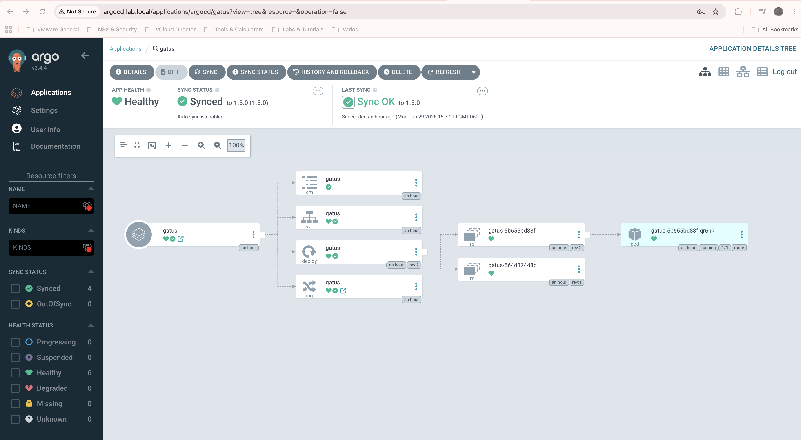
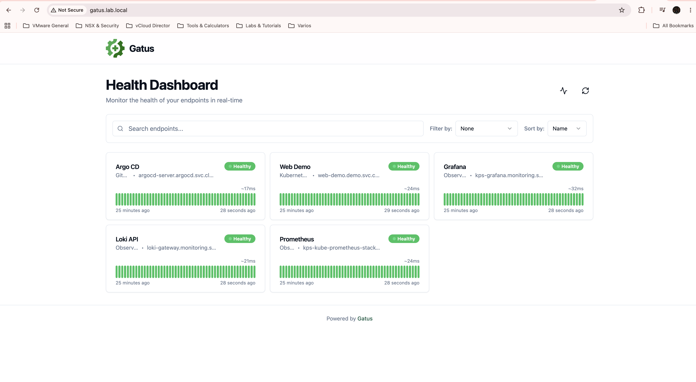
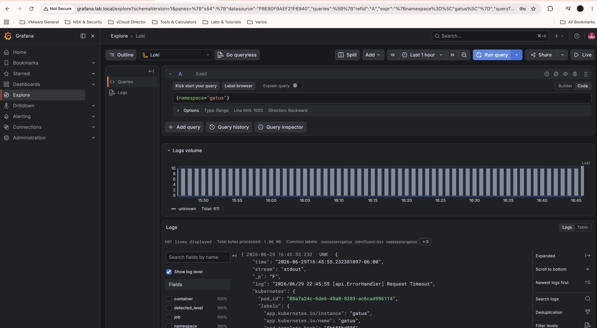
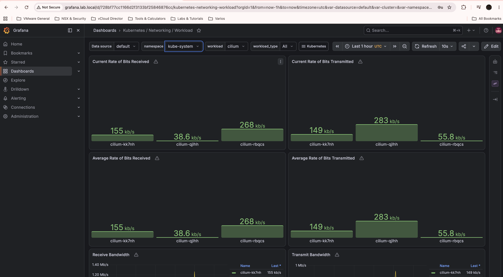
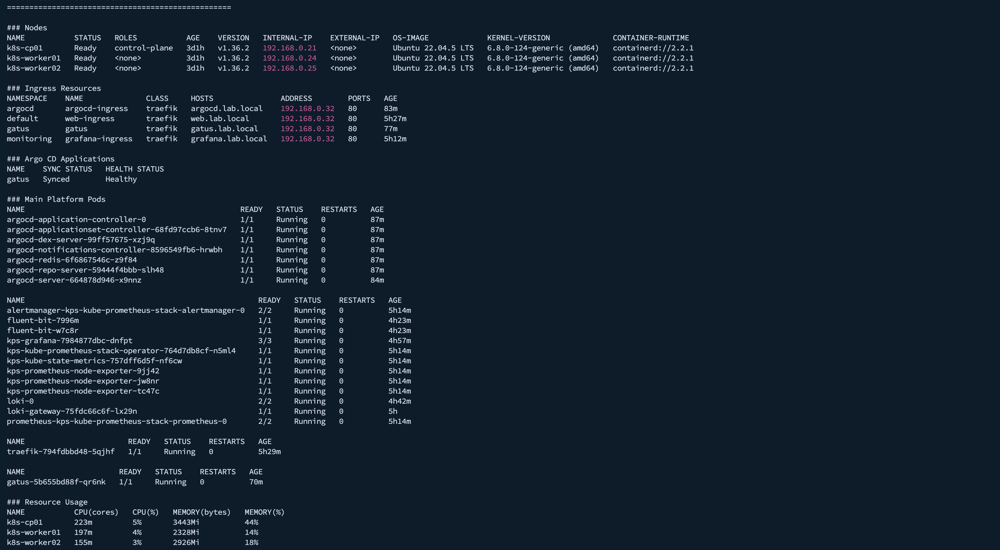

# Screenshots / Evidencia Visual

## English

This section contains visual evidence of the Kubernetes homelab platform, including GitOps, observability, logging and application health checks.

## Español

Esta sección contiene evidencia visual de la plataforma Kubernetes homelab, incluyendo GitOps, observabilidad, logging y monitoreo de aplicaciones.

---

## 1. Argo CD - Gatus Application Healthy

Argo CD managing Gatus as a Helm-based application.

Argo CD administrando Gatus como aplicación basada en Helm.

---

## 2. Gatus Dashboard

Gatus monitoring internal Kubernetes services such as Grafana, Argo CD, Loki, Prometheus and the demo application.

Gatus monitoreando servicios internos de Kubernetes como Grafana, Argo CD, Loki, Prometheus y la aplicación demo.

---

## 3. Grafana Loki Logs

Grafana Explore querying logs stored in Loki and collected by Fluent Bit.

Grafana Explore consultando logs almacenados en Loki y recolectados por Fluent Bit.

---

## 4. Grafana Kubernetes Dashboard

Kubernetes observability dashboard using Prometheus and Grafana.

Dashboard de observabilidad de Kubernetes usando Prometheus y Grafana.

---

## 5. Kubernetes Cluster Status

Terminal validation using kubectl commands from the management workstation.

Validación desde terminal usando comandos kubectl desde la máquina de administración.

